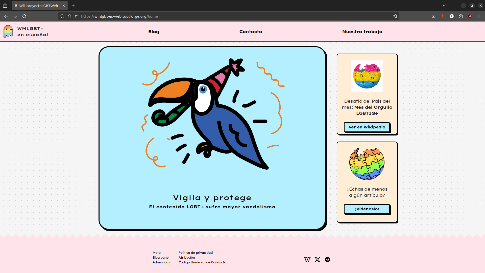
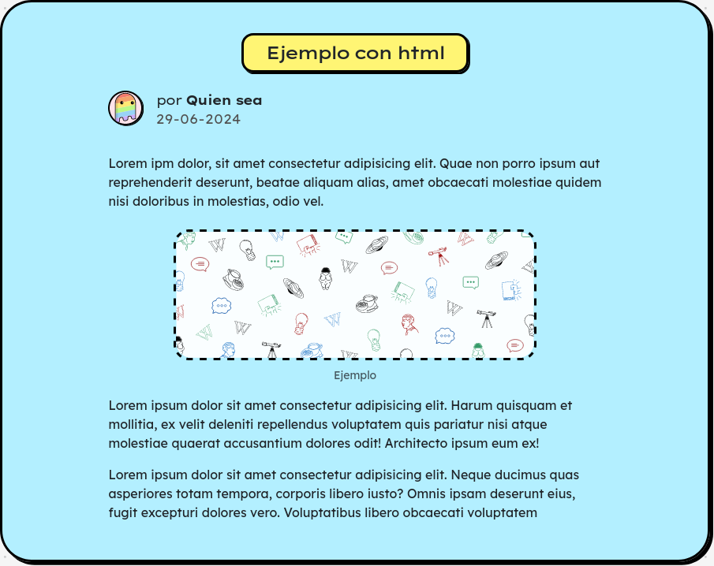
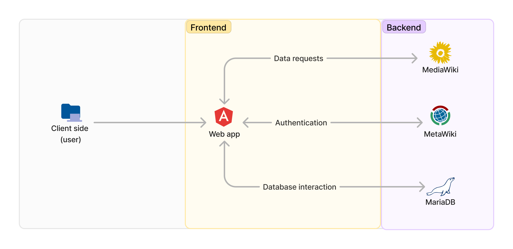
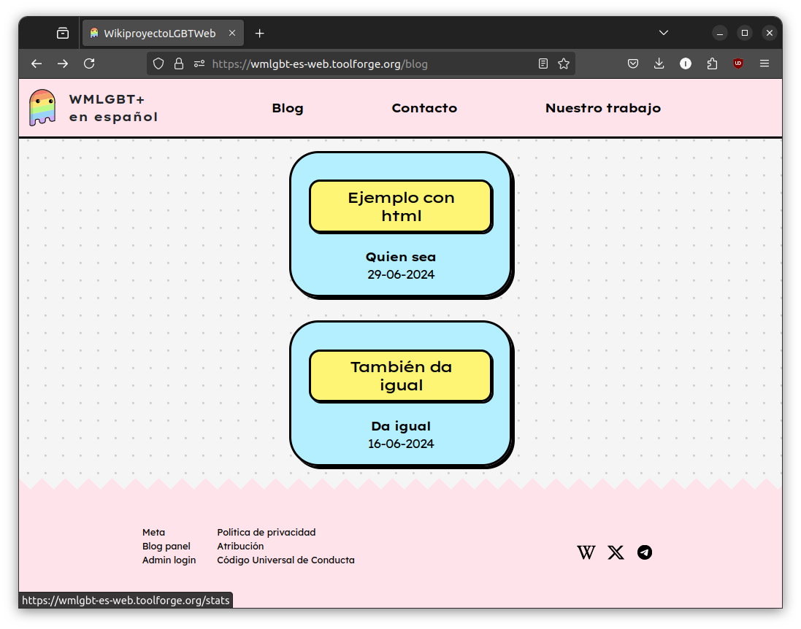
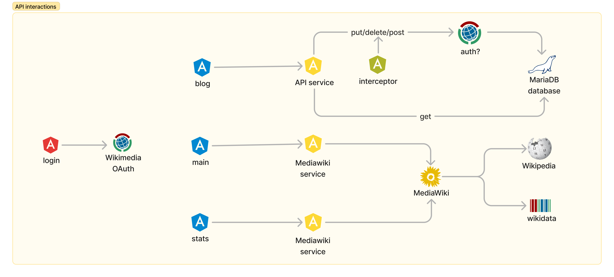
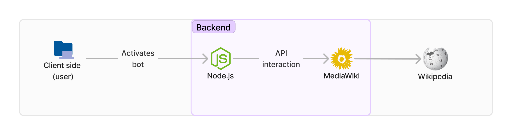
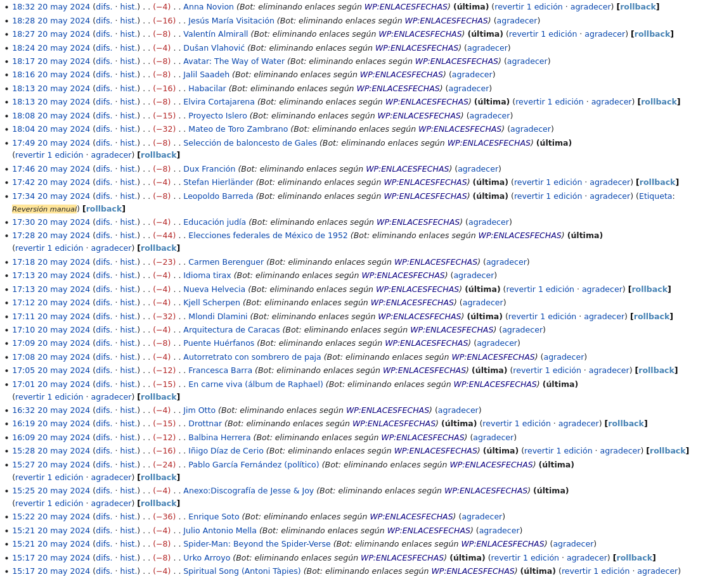

[`https://nacaru-w.github.io/memoria/memoria.pdf`](https://nacaru-w.github.io/memoria/memoria.pdf)

# Introduction {data-background-image="img/Elegant_Background-2.jpg"}
{ width=200px }

***

- Wikipedia: free encyclopedia that anyone can edit
- Depends on volunteer contributions, mostly
- Low number of technical contributors
- High demand for this kind of support
 
# Objectives {data-background-image="img/Elegant_Background-3.jpg"}

***

- To provide the Spanish Wikipedia with a community-supported bot that applies MoS rules
- To build a website that the LGBT+ WikiProject can use to display their work, common goals and achievements.

# Context and justification {data-background-image="img/Elegant_Background-7.jpg"}

## Bot

- Users invest a significant amount of time applying Manual of Style (MoS) rules.
- Many of these rules can be applied automatically through technical means.
- Less time dedicated to implementing MoS means more time creating content → primary goal of the encyclopedia

## LGBT+ WikiProject website

- Group of users dedicated to improving LGBT+ content on the Spanish Wikipedia
- Low amount of technical editors among them
- Other user groups already have their own webpage

# LGBT+ WikiProject website {data-background-color="aliceblue"}
{ width=200px }

***

[https://wmlgbt-es-web.toolforge.org](https://wmlgbt-es-web.toolforge.org)

***

[https://github.com/nacaru-w/WikiprojectLGBT-Webpage](https://github.com/nacaru-w/WikiprojectLGBT-Webpage)

## Design: web neobrutalism {data-background-color="whitesmoke"}

***
## {data-background-color="whitesmoke"}

{width=16em}

***
## {data-background-color="whitesmoke"}

{width=18em}

***
## {data-background-color="whitesmoke"}

{width=16em}

## Characteristics

- Built using [Angular 17.3](https://angular.dev/)
- Single-page application (SPA)
- Smooth transitions

## Technologies

- Uses [Bootstrap](https://getbootstrap.com/)
- Hosted in [Toolforge](https://admin.toolforge.org/)
- Interacts with [MediaWiki API](https://www.mediawiki.org/wiki/API:Main_page)
- Has its own database ([MariaDB](https://mariadb.org/))
- Authentication via [MediaWiki OAuth](https://www.mediawiki.org/wiki/OAuth/For_Developers)
- Uses [Angular Animations](https://www.npmjs.com/package/@angular/animations)

## Architecture

## Blog component

{width=16em}

## Stats component

{width=16em}

## Form component

{width=16em}

## Blog admin panel component

{width=16em}

## Blog edit component

{width=16em}

## API interactions

{width=18em}

# Manual of Style Bot {data-background-color="lightgray"}

***

[https://es.wikipedia.org/wiki/Usuario:NacaruBot](https://es.wikipedia.org/wiki/Usuario:NacaruBot)

***

[https://github.com/nacaru-w/NacaruBot](https://github.com/nacaru-w/NacaruBot)

## Asking for permission

Bots need community authorisation first

## Technologies

- Uses [node.js](https://nodejs.org/en)
- Uses [mwn](https://www.npmjs.com/package/mwn), a comprehensive bot framework
- Written in TypeScript
- Interacts through the [MediaWiki API](https://www.mediawiki.org/wiki/API:Main_page)
- Thorough log of all the actions

## Architecture

## Action

The bot erases links to internal dates in articles that are not related to the calendar

## Log

It logs every action it carries out

***

Log is also visible on Wikipedia

# Fin {data-background-image="./img/Back3.png"}